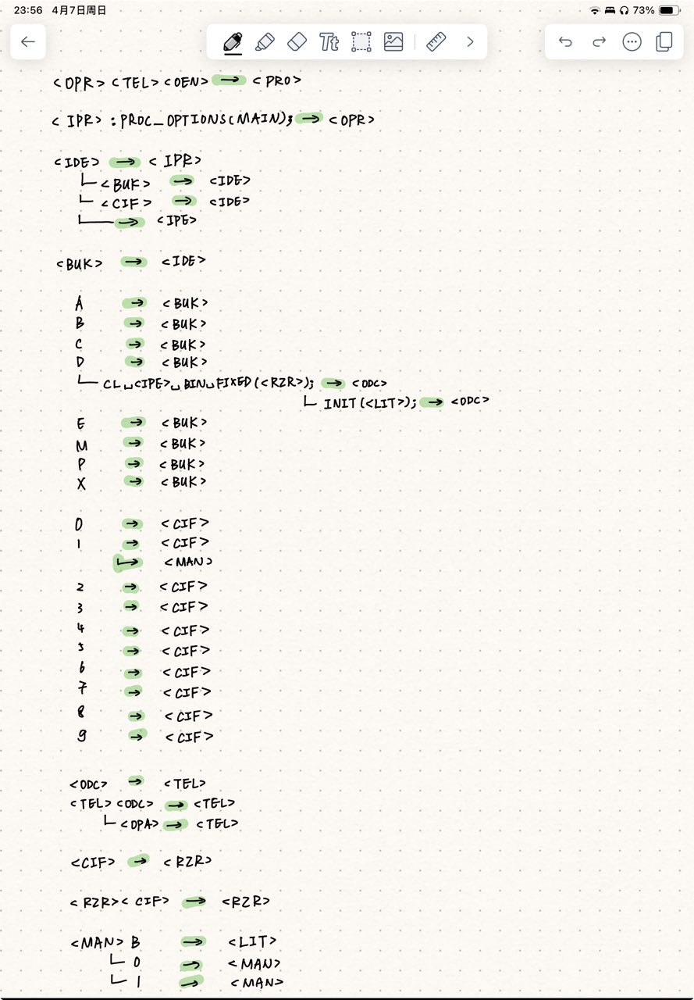
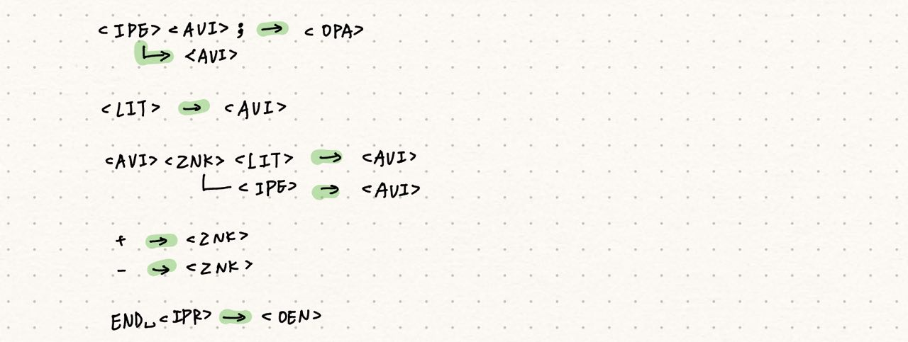

<OPR><TEL><OEN>  ──>  <PRO>
<IPR>:PROC_OPTIONS(MAIN); ──> <OPR>
<IDE>  ──> <IPR>
<BUK> | <IDE><BUK> | <IDE><CIF>  ──> <IDE>
A | B | C | D | E | M | P | X  ──> <BUK>
0 | 1 | 2 | 3 | 4 | 5 | 6 | 7 | 8 | 9  ──> <CIF>
<ODC> | <TEL><ODC> | <TEL><OPA>  ──> <TEL>
DCL_<IPE>_BIN_FIXED(<RZR>); | DCL_<IPE>_BIN_FIXED(<RZR>)INIT(<LIT>);  ──> <ODC>
<IDE>  ──> <IPE>
<CIF> | <RZR><CIF>  ──> <RZR>
<MAN>B  ──> <LIT>
1 | <MAN>0 | <MAN>1  ──> <MAN>
<IPE>=<AVI>;  ──> <OPA>
<LIT> | <IPE> | <AVI><ZNK><LIT> | <AVI><ZNK><IPE>  ──> <AVI>
+ | -  ──> <ZNK>
END_<IPR>  ──>  <OEN>

---

<OPR><TEL><OEN>  ──>  <PRO>
<IPR>:PROC_OPTIONS(MAIN); ──> <OPR>
<IDE>  ──> <IPR>
<BUK> ──> <IDE>
<IDE><BUK> ──> <IDE>
<IDE><CIF> ──> <IDE>
A  ──> <BUK>
B  ──> <BUK>
C  ──> <BUK>
D  ──> <BUK>
E  ──> <BUK>
M  ──> <BUK>
P  ──> <BUK>
X  ──> <BUK>
0  ──> <CIF>
1  ──> <CIF>
2  ──> <CIF>
3  ──> <CIF>
4  ──> <CIF>
5  ──> <CIF>
6  ──> <CIF>
7  ──> <CIF>
8  ──> <CIF>
9  ──> <CIF>
<ODC> ──> <TEL>
<TEL><ODC> ──> <TEL>
<TEL><OPA> ──> <TEL>
DCL_<IPE>_BIN_FIXED(<RZR>); ──> <ODC>
DCL_<IPE>_BIN_FIXED(<RZR>)INIT(<LIT>);  ──> <ODC>
<IDE>  ──> <IPE>
<CIF> ──> <RZR>
<RZR><CIF>  ──> <RZR>
<MAN>B  ──> <LIT>
1  ──> <MAN>
<MAN>0  ──> <MAN>
<MAN>1  ──> <MAN>
<IPE>=<AVI>;  ──> <OPA>
<LIT> ──> <AVI>
<IPE> ──> <AVI>
<AVI><ZNK><LIT>  ──> <AVI>
<AVI><ZNK><IPE> ──> <AVI>
+ ──> <ZNK>
- ──> <ZNK>
END_<IPR>  ──>  <OEN>

---

<OPR><TEL><OEN>  ──>  <PRO>
<IPR>:PROC_OPTIONS(MAIN); ──> <OPR>

<IDE> ──> <IPR>
<IDE><BUK> ──> <IDE>
<IDE><CIF> ──> <IDE>
<IDE>  ──> <IPE>

<BUK> ──> <IDE>
A  ──> <BUK>
B  ──> <BUK>
C  ──> <BUK>
D  ──> <BUK>
DCL_<IPE>_BIN_FIXED(<RZR>); ──> <ODC>
DCL_<IPE>_BIN_FIXED(<RZR>)INIT(<LIT>); ──> <ODC>
E  ──> <BUK>
M  ──> <BUK>
P  ──> <BUK>
X  ──> <BUK>

0  ──> <CIF>
1  ──> <CIF>
1  ──> <MAN>
2  ──> <CIF>
3  ──> <CIF>
4  ──> <CIF>
5  ──> <CIF>
6  ──> <CIF>
7  ──> <CIF>
8  ──> <CIF>
9  ──> <CIF>

<ODC> ──> <TEL>
<TEL><ODC> ──> <TEL>
<TEL><OPA> ──> <TEL>

<CIF> ──> <RZR>

<RZR><CIF>  ──> <RZR>

<MAN>B  ──> <LIT>
<MAN>0  ──> <MAN>
<MAN>1  ──> <MAN>

<IPE><AVI>;  ──> <OPA>
<IPE> ──> <AVI>

<LIT> ──> <AVI>

<AVI><ZNK><LIT>  ──> <AVI>
<AVI><ZNK><IPE> ──> <AVI>

+ ──> <ZNK>
- ──> <ZNK>
END_<IPR>  ──>  <OEN>

---

---

current result:

EX10        START 0             Program starts                                             
            BALR  RBASE,0       Load base register                                       
            USING *,RBASE       Set base register                                      
            MVC    @BUF+2(6)    Move from cache A to @BUF         
            CVB    @RRAB, @BUF  Convert to binary.         
            STH    @RRAB, B     Store Halfword.         
            BCR   15,@RVIX      Exit from program                                  
A           DC    PL6'10'       Initialization DECIMAL.
B           DS    0F            Initialization BIT.         
            DS    0F            Memory allocation for CVB.
@BUF        DC    PL8'0'        Buffer for CVB.
@RVIX       EQU   14                                                               
@RBASE      EQU   15                                                               
@RRAB       EQU   5                                                                         
END         EX10                End of program                                     
